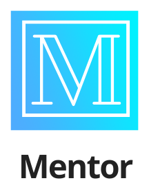

# QuickHack 2021 Hackathon

### Team: Potato Batteries

### Theme: Career

 

# About

Mentor is the solution for curious students who want to know more about the many professional fields available in the world.

# How to run the app 
  
Download the app-release.apk file and install it in an Android device (emulated devices works as well). After installation, run the app.
  
## Notes
  
The app is an incomplete mockup of our app which has a functional UI that showcases how using the app would feel like. There are other functions that we wanted to implement but do not have the skills necessary to add into the app. Those ideas are shown in the pitch video and in the less tangible but more idealized mockup that was designed using the Marvel App. We have included a PowerPoint presentation pitch to show what our presentation would have included if we had to present to a live audience.
